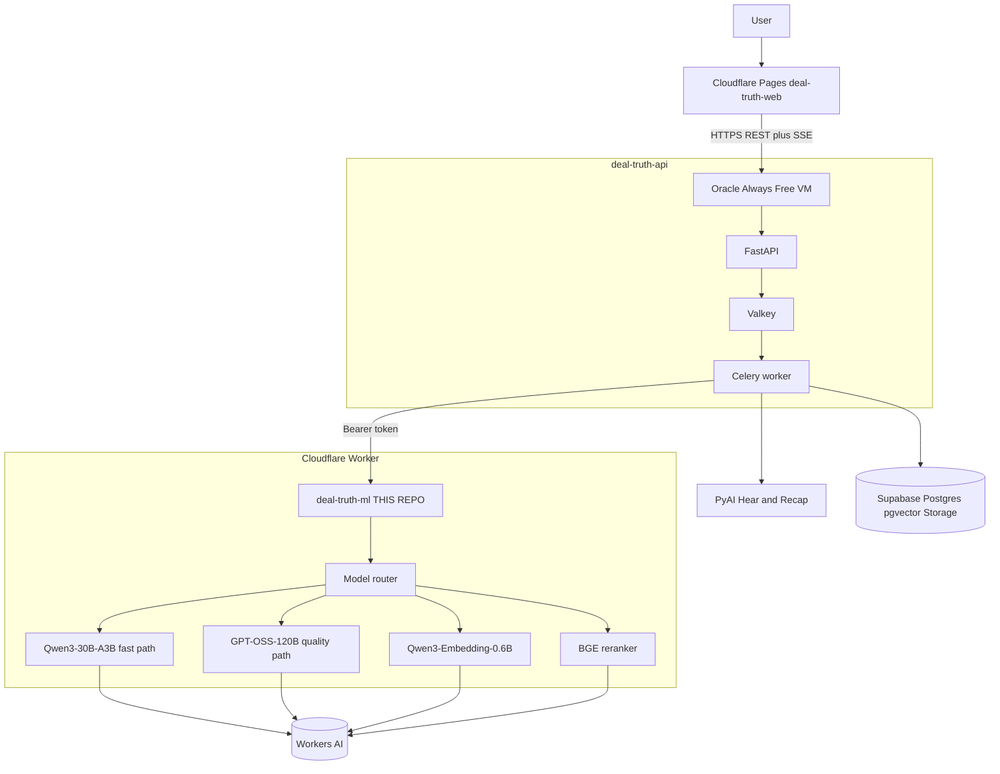

# Deal Truth ML

Hosted inference router for **Deal Truth**. This repo is a **Cloudflare Worker**: it routes classify / emotion / embed / rerank / generate to **Workers AI**. No model weights run on your laptop or on the Oracle VM.

**Emotion is not buying intent.** Those axes stay separate.

Full product map: [docs/PROJECT_CONTEXT.md](docs/PROJECT_CONTEXT.md). Local + production env: [docs/DEPLOYMENT.md](docs/DEPLOYMENT.md).

---

## What `make up` does

Same idea as `deal-truth` (`make up` there starts Postgres, Redis, SeaweedFS, API, worker).

Here, **one command starts the ML Worker on port 8081**, opens an **ngrok HTTPS tunnel**, and waits until health is green:

1. Creates `.dev.vars` and `.env` from examples if missing (empty placeholders only). Copies `NGROK_AUTHTOKEN` from sibling `deal-truth/.env` when this file is still empty (never printed).
2. Requires Cloudflare auth: `CLOUDFLARE_API_TOKEN` in `.env`, **or** a successful `npx wrangler whoami` (OAuth on macOS is under `~/Library/Preferences/.wrangler`, mounted into the container).
3. `docker compose up --build` for `ml` (`wrangler dev` on **:8081**) and `ngrok` (inspector **:4041**, so it does not collide with the API tunnel on **:4040**).
4. Curls `/health/live` until ready, then prints the public URL. `APP_NAME=deal-truth-ml` sets `NGROK_DOMAIN=deal-truth-ml-ngrok.ngrok-free.app` (same pattern as the API’s `deal-truth-ngrok.ngrok-free.app`). `make up` writes `ML_NGROK_DOMAIN` into sibling `deal-truth/.env`. Same-machine Docker API keeps `ML_SERVICE_BASE_URL=http://host.docker.internal:8081`.

The container does **not** download Qwen/GPT-OSS. It calls **Cloudflare Workers AI** with your account quota (10k neurons/day on Free).

```bash
make setup    # npm install + env files
make login    # browser OAuth (host path)  OR  put CLOUDFLARE_API_TOKEN in .env
make up       # Docker on :8081
# make down
```

Host process instead of Docker (like `make api` in the API repo):

```bash
make setup
make login
make dev      # wrangler on :8081 in the foreground
```

Then start the API stack in `/Users/debjyoti_pandit/Work/github/deal-truth` with `make up` as you already do.

Docs on a running Worker (also on the ML ngrok host):

- Catalog: `http://localhost:8081/v1/reference` (alias `/api/v1/reference`)
- Example: `http://localhost:8081/v1/reference/API.md`

---


## Local stack with the API (Docker)

```text
deal-truth-web          →  http://localhost:5173
deal-truth API/Celery   →  http://localhost:8000   + ngrok :4040
deal-truth-ml wrangler  →  http://localhost:8081   + ngrok :4041
                              │
                              ▼
                       Cloudflare Workers AI
```

Use **localhost:8081** when the API is on the same machine. Use the **ML ngrok HTTPS URL** when the API is in Docker on Linux without host gateway, on another machine, or on the Oracle VM.


### Env in **this** repo


| File | Vars | Notes |
| --- | --- | --- |
| [`.dev.vars`](.dev.vars.example) | `INTERNAL_API_TOKEN=` | Wrangler secret. **Leave empty locally** so the API needs no Bearer. |
| [`.env`](.env.example) | `CLOUDFLARE_API_TOKEN`, `CLOUDFLARE_ACCOUNT_ID`, `ML_PORT=8081` | Cloudflare token only if you are not using `wrangler login`. |
| [`.env`](.env.example) | `APP_NAME=deal-truth-ml`, `NGROK_AUTHTOKEN`, `NGROK_DOMAIN` | Domain defaults to `{APP_NAME}-ngrok.ngrok-free.app` (`deal-truth-ml-ngrok.ngrok-free.app`). Must differ from the API host `deal-truth-ngrok.ngrok-free.app`. Inspector **4041**. |


Do **not** put `ML_SERVICE_`* in this repo. Those belong on the API.

Model IDs are already in `wrangler.jsonc`. You do not need to set them unless you are overriding.

### Env in **deal-truth** (`deal-truth/.env`)


| Var | Same machine | API cannot see localhost (Docker/remote) |
| --- | --- | --- |
| `ML_SERVICE_BASE_URL` | `http://localhost:8081` (API on host) or `http://host.docker.internal:8081` (API in Docker on Mac) | `https://$ML_NGROK_DOMAIN` (`deal-truth-ml-ngrok.ngrok-free.app`) |
| `ML_NGROK_DOMAIN` | `deal-truth-ml-ngrok.ngrok-free.app` | same; `make up` in this repo writes it into `deal-truth/.env` |
| `ML_SERVICE_API_KEY` | empty | empty unless `INTERNAL_API_TOKEN` is set |
| `ML_GENERATION_ENABLED` | `true` | `true` |


Restart **api** and **worker** after changing those (`cd ../deal-truth && make restart` or `make up`).

Web: no ML env. Keep `VITE_API_BASE_URL` on the API.

### Order

```bash
# 1. ML
cd /Users/debjyoti_pandit/Work/github/deal-truth-ml
cp .env.example .env          # then paste CLOUDFLARE_API_TOKEN
make up

# 2. Confirm ML
curl -sS http://localhost:8081/health/ready
curl -sS -X POST http://localhost:8081/classify \
  -H "Content-Type: application/json" \
  -d '{"texts":["We cannot buy until security approves it."]}'

# 3. API (already working)
cd /Users/debjyoti_pandit/Work/github/deal-truth
# set ML_SERVICE_BASE_URL as in the table above
make up
```

The API calls these **compat** paths on `:8081`: `POST /classify`, `/emotion`, `/embed`, `/generate`.

---


## Architecture




## Model routing


| Path    | Model                           | Used for                                                     |
| ------- | ------------------------------- | ------------------------------------------------------------ |
| Fast    | `@cf/qwen/qwen3-30b-a3b-fp8`    | Segment classify, sales-emotion taxonomy, stage-1 candidates |
| Quality | `@cf/openai/gpt-oss-120b`       | Stage-2 judge, Ask-the-Call synthesis, high-stakes reasoning |
| Embed   | `@cf/qwen/qwen3-embedding-0.6b` | 1024-dim embeddings (8,192-token context)                    |
| Rerank  | `@cf/baai/bge-reranker-base`    | Passage rerank for Ask-the-Call                              |


Never ask 120B to rediscover the whole call. Stage 1 proposes candidates. Stage 2 judges only relevant segments. The backend evidence validator still decides what ships.

## Neuron budget (Workers AI Free)

Free plan: **10,000 neurons/day**. Exhaustion returns `QUOTA_EXCEEDED` instead of auto-billing. A typical 5k-in / 2k-out GPT-OSS pass is ~295 neurons.

## Makefile


| Target         | What happens                                          |
| -------------- | ----------------------------------------------------- |
| `make setup`   | `npm install`, create `.dev.vars` / `.env` if missing |
| `make login`   | `wrangler login` + `whoami`                           |
| `make up` | Docker Compose `ml` on **:8081** + **ngrok** inspector **:4041**, wait for health, print public URL |
| `make down` | `docker compose down` |
| `make restart` | After code changes: rebuild `ml`, recreate `ml` + `ngrok`, wait for `/health/live` |
| `make dev`     | Host `wrangler dev` on **:8081** (foreground)         |
| `make check`   | `GET /health/live`                                    |
| `make smoke`   | health + sample `POST /classify`                      |
| `make test`    | Vitest with fake AI (no Cloudflare)                   |
| `make deploy`  | `wrangler secret put` + `wrangler deploy`             |


## Tests

```bash
make test
make lint
make typecheck
```

Live Workers AI (deployed or local, real models):

```bash
RUN_MODEL_TESTS=1 ML_SERVICE_BASE_URL=http://127.0.0.1:8081 npm run test:live
```


## Deploy (production Worker)

```bash
npx wrangler secret put INTERNAL_API_TOKEN
npx wrangler deploy
```

Then in **deal-truth** production env:

```text
ML_SERVICE_BASE_URL=https://deal-truth-ml.<account>.workers.dev
ML_SERVICE_API_KEY=<same as INTERNAL_API_TOKEN>
```


## curl examples

Local Docker/host uses port **8081**. Leave `TOKEN` empty when `INTERNAL_API_TOKEN` is empty (drop the Authorization header).

```bash
export BASE=http://127.0.0.1:8081
```


### Health

```bash
curl -sS "$BASE/health/live"
curl -sS "$BASE/health/ready"
```


### Models and labels

```bash
curl -sS "$BASE/v1/models"
curl -sS "$BASE/v1/sales-labels"
```


### Classify

```bash
curl -sS -X POST "$BASE/v1/classify" \
  -H "Content-Type: application/json" \
  -H "X-Request-ID: demo-1" \
  -d '{
    "items": [{"id": "segment-1", "text": "We cannot buy anything until security approves it."}],
    "threshold": 0.5,
    "top_k": 10
  }'
```


### Emotions (three separate axes)

```bash
curl -sS -X POST "$BASE/v1/emotions" \
  -H "Content-Type: application/json" \
  -d '{
    "items": [{
      "id": "segment-1",
      "text": "I absolutely love this product, but finance froze our budget until next year."
    }]
  }'
```


### Embeddings

```bash
curl -sS -X POST "$BASE/v1/embeddings" \
  -H "Content-Type: application/json" \
  -d '{
    "items": [{"id": "chunk-1", "text": "Customer requires security approval."}],
    "normalize": true
  }'
```


### Rerank

```bash
curl -sS -X POST "$BASE/v1/rerank" \
  -H "Content-Type: application/json" \
  -d '{
    "query": "Why could this deal fail?",
    "passages": [
      {"id": "a", "text": "Security review is mandatory."},
      {"id": "b", "text": "The weather is nice."}
    ],
    "top_k": 5
  }'
```


### Generate (not factually grounded)

```bash
curl -sS -X POST "$BASE/v1/generate" \
  -H "Content-Type: application/json" \
  -d '{
    "task": "email_polish",
    "input": "Thanks for the time today. I will send the SOC2 pack.",
    "max_new_tokens": 180,
    "temperature": 0
  }'
```


### Analyze call (Qwen candidates, GPT-OSS judge)

```bash
curl -sS -X POST "$BASE/v1/analyze-call" \
  -H "Content-Type: application/json" \
  -d '{
    "segments": [
      {"id": "1", "speaker_role": "customer", "text": "We spend six hours a week routing calls."},
      {"id": "2", "speaker_role": "customer", "text": "I love this, but finance froze our budget until next year."}
    ]
  }'
```


### Backend compat aliases (what deal-truth actually calls)

```bash
curl -sS -X POST "$BASE/classify" -H "Content-Type: application/json" \
  -d '{"texts":["Security must approve any vendor."],"labels":["security blocker","customer praise"]}'
curl -sS -X POST "$BASE/emotion" -H "Content-Type: application/json" \
  -d '{"texts":["This looks impressive, but we have no budget this year."]}'
curl -sS -X POST "$BASE/embed" -H "Content-Type: application/json" \
  -d '{"texts":["Customer requires security approval."]}'
curl -sS -X POST "$BASE/generate" -H "Content-Type: application/json" \
  -d '{"prompt":"Polish this email.","max_tokens":80}'
```

If you set `INTERNAL_API_TOKEN`, add `-H "Authorization: Bearer $TOKEN"` to `/v1/*` and compat POSTs.

## Environment variables (Worker)


| Name                    | Default                         | Where                         | Purpose                       |
| ----------------------- | ------------------------------- | ----------------------------- | ----------------------------- |
| `INTERNAL_API_TOKEN`    | empty                           | `.dev.vars` / wrangler secret | Bearer for `/v1/*` and compat |
| `ENABLE_GENERATION`     | `true`                          | `wrangler.jsonc`              | `/generate`                   |
| `MAX_BATCH_SIZE`        | `32`                            | `wrangler.jsonc`              | batch cap                     |
| `MAX_TEXT_CHARS`        | `8000`                          | `wrangler.jsonc`              | text cap                      |
| `FAST_MODEL_ID`         | `@cf/qwen/qwen3-30b-a3b-fp8`    | `wrangler.jsonc`              | fast path                     |
| `QUALITY_MODEL_ID`      | `@cf/openai/gpt-oss-120b`       | `wrangler.jsonc`              | quality path                  |
| `EMBEDDING_MODEL_ID`    | `@cf/qwen/qwen3-embedding-0.6b` | `wrangler.jsonc`              | embeddings                    |
| `RERANK_MODEL_ID`       | `@cf/baai/bge-reranker-base`    | `wrangler.jsonc`              | rerank                        |
| `EMBEDDING_DIMENSION`   | `1024`                          | `wrangler.jsonc`              | reported dim                  |
| `CLOUDFLARE_API_TOKEN`  | empty                           | `.env` (Docker)               | Wrangler auth in Compose      |
| `CLOUDFLARE_ACCOUNT_ID` | empty                           | `.env` (Docker)               | Account for the token         |


Do not commit `.dev.vars` or `.env`. Transcript text is never logged.

## Privacy

- Logs: request ID, counts, model, duration, named error — never transcript text.
- CORS is not permissive; the backend calls this Worker, not the browser.
- Constant-time token comparison when a token is set.


## Named limitations

- Daily Workers AI neuron quota can exhaust (`QUOTA_EXCEEDED`).
- Cloudflare may change model catalogue or IDs.
- Models can hallucinate; the API evidence validator is the ship gate.
- Compat `/emotion` is not GoEmotions.
- Embeddings are 1024-dim; the API still uses `VECTOR(384)` until migrated — Ask-the-Call / indexing may fail locally.
- No models on the Oracle VM or in this Docker image.


## License

MIT. See [LICENSE](LICENSE), [THIRD_PARTY_LICENSES.md](THIRD_PARTY_LICENSES.md), and [docs/LICENSE_AUDIT.md](docs/LICENSE_AUDIT.md).